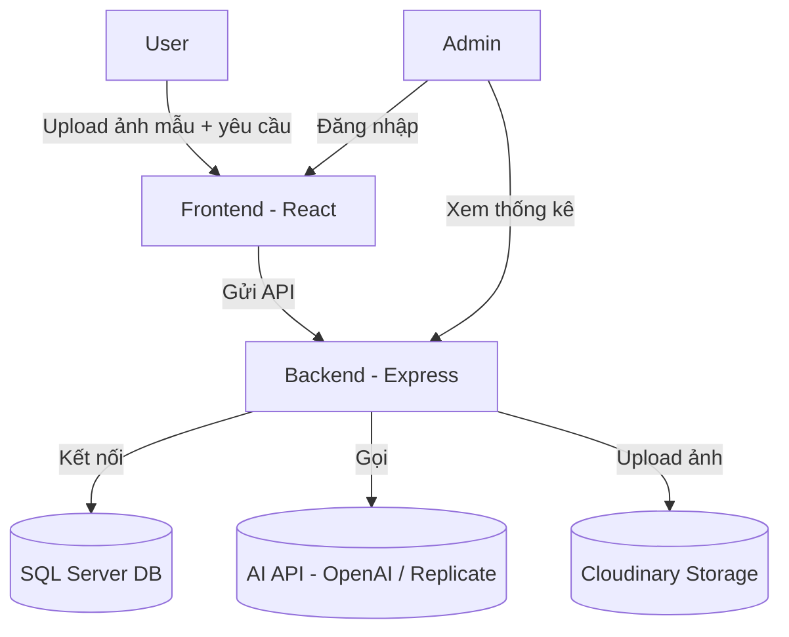
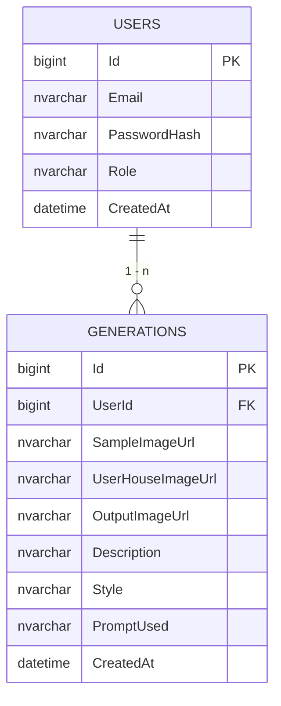
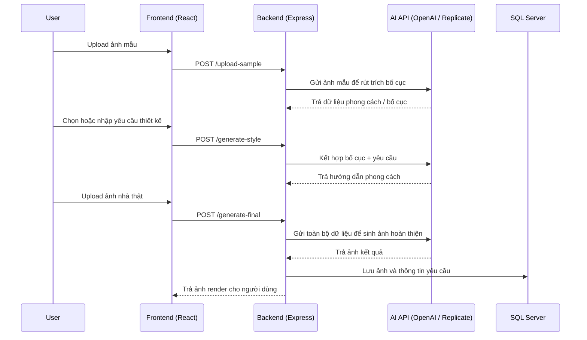

# AI Exterior Suggestion System

## 📌 Mục tiêu
Hệ thống gợi ý thiết kế ngoại thất (màu sơn, bố trí) dựa vào ảnh đầu vào và yêu cầu người dùng.  
Gồm 2 phần:
- **Chat AI (text)**: gợi ý mô tả.
- **Sinh ảnh (image)**: render ảnh ngoại thất.
- **Profile**: diện tích, phong cách, ngân sách → cá nhân hoá.
- **History**: lưu lại yêu cầu & kết quả.

## 🛠️ Tech Stack
- **Frontend**: React + Vite + Tailwind
- **Backend**: Node.js + Express
- **Database**: SQL Server
- **Cloud Storage**: Cloudinary
- **AI API**: OpenAI / Replicate

## 🚀 Cách chạy nhanh
### Backend
```bash
cd backend
npm install
npm run dev
```
# **HỆ THỐNG GỢI Ý NGOẠI THẤT CĂN NHÀ**

**Phân tích & Thiết kế hệ thống — Sinh viên năm 4**

---

## **1. Giới thiệu đề tài**

**Tên đề tài:** Hệ thống gợi ý cho ngoại thất căn nhà
**Mục tiêu:**
Xây dựng website ứng dụng trí tuệ nhân tạo giúp người dùng tạo ra phương án thiết kế ngoại thất dựa trên ảnh mẫu, ảnh thật của căn nhà và các yêu cầu cụ thể.

**Đối tượng sử dụng:**

* **Người dùng (User):** khách hàng muốn tham khảo hoặc gợi ý thiết kế ngoại thất.
* **Quản trị viên (Admin):** người quản lý hệ thống, theo dõi log và thống kê hoạt động.

**Phạm vi:**

* **User:** upload ảnh mẫu, chọn hoặc nhập yêu cầu thiết kế, tải ảnh nhà thật để AI xử lý và trả lại bản gợi ý hoàn chỉnh.
* **Admin:** xem thống kê người dùng, giám sát lịch sử hoạt động, quản lý dữ liệu và API.

---

## **2. Mục tiêu cụ thể của hệ thống**

* Cho phép người dùng tải ảnh mẫu căn nhà mong muốn và ảnh thật căn nhà của họ.
* AI rút trích bố cục, phong cách từ ảnh mẫu.
* Kết hợp ảnh thật với phong cách mẫu và yêu cầu thiết kế để tạo ảnh gợi ý hoàn thiện.
* Lưu trữ và hiển thị lịch sử thao tác của người dùng.
* Hỗ trợ admin quản lý người dùng và thống kê hệ thống.

---

## **3. Mô hình tổng quan hệ thống**



---

## **4. Kiến trúc công nghệ**

| Thành phần | Công nghệ sử dụng                            | Chức năng                                   |
| ---------- | -------------------------------------------- | ------------------------------------------- |
| Frontend   | React + Vite + Tailwind CSS                  | Giao diện người dùng (User, Admin)          |
| Backend    | Node.js + Express                            | API xử lý logic, xác thực JWT, kết nối DB   |
| Database   | SQL Server                                   | Lưu trữ người dùng, lịch sử thao tác        |
| Storage    | Cloudinary                                   | Lưu ảnh người dùng upload và ảnh sinh từ AI |
| AI Engine  | OpenAI / Replicate (Stable Diffusion / FLUX) | Rút trích bố cục và sinh ảnh gợi ý          |

---

## **5. Quy trình sử dụng của người dùng (User Flow)**

1. **Upload ảnh mẫu:** người dùng tải lên ảnh của một căn nhà có thiết kế đẹp mà họ mong muốn.
2. **AI rút trích bố cục:** hệ thống phân tích ảnh mẫu, lưu phong cách và bố cục làm cơ sở.
3. **Chọn hoặc nhập yêu cầu:** người dùng chọn các yêu cầu thiết kế sẵn (ví dụ: thêm lam gỗ, tone sáng, ban công rộng hơn) hoặc nhập yêu cầu riêng qua chat.
4. **AI kết hợp thông tin:** hệ thống kết hợp bố cục mẫu với yêu cầu vừa nhập để định hướng phong cách.
5. **Upload ảnh nhà thật:** người dùng tải ảnh căn nhà của họ (nhà thô hoặc đã xây).
6. **Sinh ảnh kết quả:** AI sử dụng dữ liệu đã rút trích + ảnh thật + yêu cầu để sinh ảnh gợi ý cuối cùng.
7. **Xem và lưu lịch sử:** người dùng xem ảnh kết quả, có thể tải xuống hoặc xem lại trong trang cá nhân.

---

## **6. Phân tích chức năng theo vai trò**

### **Người dùng (User)**

* Đăng ký, đăng nhập hệ thống.
* Upload ảnh mẫu căn nhà tham khảo.
* Nhập hoặc chọn yêu cầu thiết kế.
* Upload ảnh nhà thật của mình để AI xử lý.
* Nhận ảnh gợi ý thiết kế hoàn thiện.
* Xem lại lịch sử thiết kế trong trang cá nhân.

### **Quản trị viên (Admin)**

* Đăng nhập với quyền admin.
* Quản lý người dùng, thống kê số lượng yêu cầu và lượt sinh ảnh.
* Theo dõi log và tình trạng API.

---

## **7. Mô hình cơ sở dữ liệu**



---

## **8. Sơ đồ Use Case**

```mermaid
usecaseDiagram
actor User
actor Admin

rectangle System {
    User --> (Đăng ký tài khoản)
    User --> (Đăng nhập)
    User --> (Upload ảnh mẫu)
    User --> (Nhập yêu cầu thiết kế)
    User --> (Upload ảnh nhà thật)
    User --> (Xem ảnh gợi ý hoàn thiện)
    User --> (Xem lịch sử thiết kế)

    Admin --> (Đăng nhập)
    Admin --> (Quản lý người dùng)
    Admin --> (Xem thống kê hệ thống)
}
```

---

## **9. Sơ đồ Sequence – Quy trình sinh ảnh gợi ý**



---

## **10. Thiết kế giao diện (mô tả)**

| Trang                         | Nội dung chính                                                     |
| ----------------------------- | ------------------------------------------------------------------ |
| **Trang Upload mẫu**          | Form tải ảnh mẫu, preview ảnh, nút “Tiếp tục”                      |
| **Trang Chọn yêu cầu**        | Danh sách yêu cầu thiết kế sẵn + ô chat nhập thêm yêu cầu          |
| **Trang Upload ảnh nhà thật** | Upload ảnh căn nhà của người dùng, hiển thị kết quả sinh ảnh gợi ý |
| **Trang Cá nhân**             | Hiển thị lịch sử ảnh đã sinh + xem chi tiết                        |
| **Admin Dashboard**           | Quản lý người dùng, thống kê lượt sử dụng AI                       |

---

## **11. Quy trình phát triển**

1. Phân tích yêu cầu → Thiết kế CSDL.
2. Xây dựng backend (Express + SQL Server).
3. Xây dựng frontend (React + Tailwind).
4. Tích hợp AI (phân tích ảnh mẫu, sinh ảnh kết quả).
5. Kiểm thử và triển khai.

---

## **12. Hướng phát triển**

* Tích hợp AI nhận diện vật liệu để tái tạo chính xác hơn.
* Cho phép gợi ý nhiều phong cách khác nhau từ cùng một ảnh mẫu.
* Hỗ trợ AI so sánh trước/sau trực quan (slider).
* Triển khai phiên bản mobile và thêm gợi ý nội thất đồng bộ.
