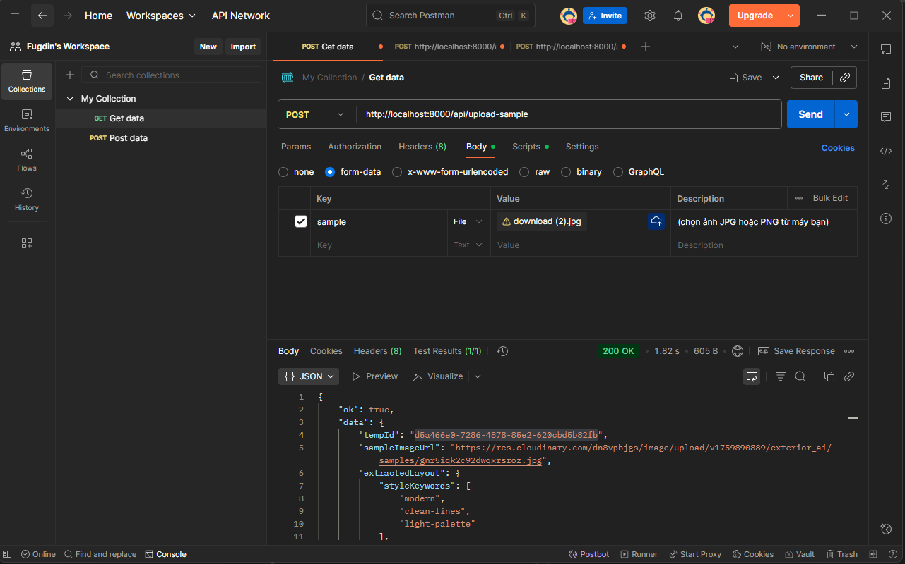
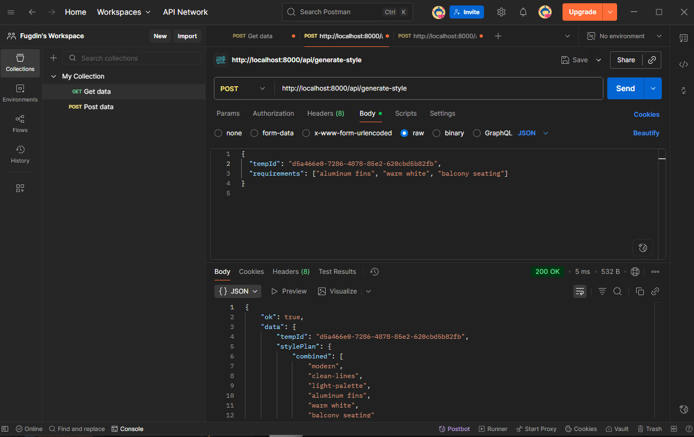
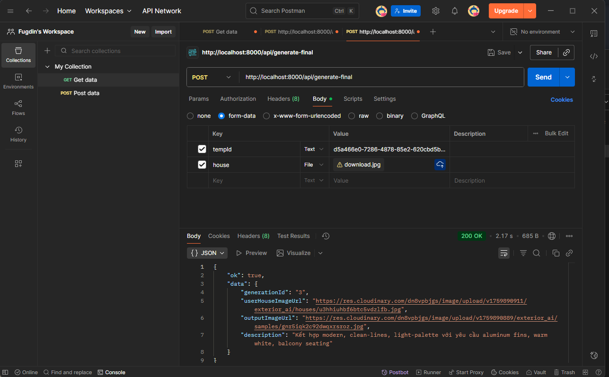
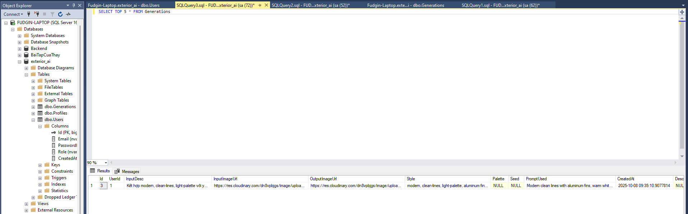

# 🧩 — Backend Mock API (07/10 → 13/10)

## 🎯 Mục tiêu
- Hoàn thiện 3 API mock:  
  `/api/upload-sample`, `/api/generate-style`, `/api/generate-final`
- Upload ảnh Cloudinary thành công  
- Lưu bản ghi vào SQL Server (bảng `Generations`)

---

## 1️⃣ /api/upload-sample
**Mô tả:** Upload ảnh mẫu lên Cloudinary, trả về `sampleImageUrl` & `tempId`.  
**Minh chứng:**

---

## 2️⃣ /api/generate-style
**Mô tả:** Kết hợp yêu cầu người dùng và layout mẫu để tạo `stylePlan`.  
**Minh chứng:**

---

## 3️⃣ /api/generate-final
**Mô tả:** Upload ảnh nhà thật, kết hợp phong cách và lưu DB.  
**Minh chứng:**

---

## 4️⃣ Bảng Generations (SQL Server)
**Kết quả:** Lưu thành công bản ghi sau khi gọi API.  

---

✅ **Kết quả :**
- [x] API mock chạy ổn định
- [x] Upload Cloudinary OK  
- [x] Lưu DB thành công  
